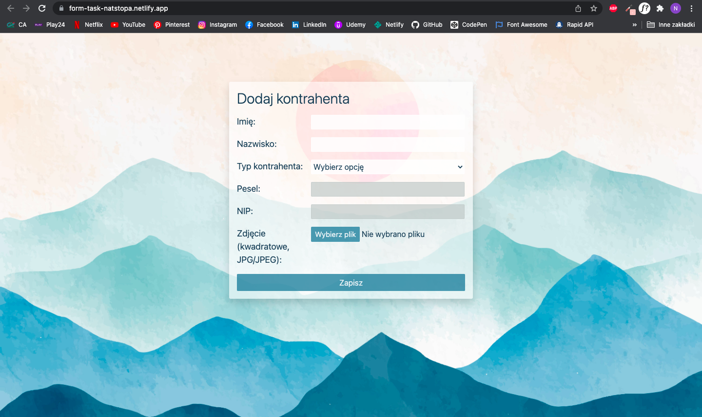

# form-task
### Client adding form with PESEL/NIP validation

## This web page is hosted here!
 https://form-task-natstopa.netlify.app/

## Table of Contents
* [General Info](#general-information)
* [Technologies Used](#technologies-used)
* [Features](#features)
* [Screenshots](#screenshots)
* [Project Status](#project-status)
* [Author](#author)

## General Information
Simple form with Pesel and NIP validation. Page made as a recruitment task.
 
Form asks for full name, client type, Pesel/NIP number and a photo.

## Technologies Used
* HTML5
* CSS3
* JavaScript
* Bootstrap v5.1
* Axios

## Features
* When client type is chosen it asks for: Pesel number for individual clients, or NIP number for companies
* Validation of Pesel number and NIP
* Validation of photo: client can add only square photo in jpg/jpg
* It shows added photo preview

## Screenshots

## Project status
Project is: _no longer being worked on_ 

## Author
Created by [Nat Stopa](https://natstopa-portfolio.netlify.app/)
